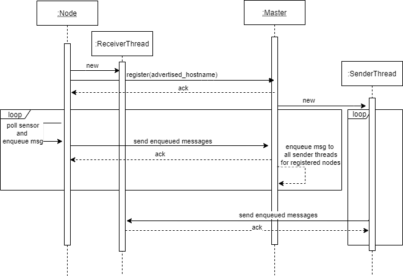

# fogmsg - Simulated device-cloud messages

- [fogmsg - Simulated device-cloud messages](#fogmsg---simulated-device-cloud-messages)
  - [Requirements](#requirements)
    - [Quickstart](#quickstart)
  - [Components](#components)
    - [Master](#master)
    - [Edge Node](#edge-node)
    - [Messaging](#messaging)

## Requirements

- Linux based system (Tested on Ubuntu 20.04)
- Python 3 (Tested on version 3.8.2)
- Install wheel, i.e. `pip install wheel`
- Python Packages from `requirements.txt` (i.e. run `pip install -r requirements.txt`)
- If installation of requirements still fails, run `sudo apt-get install build-essential python3-dev --yes` and retry to install the python requirements

### Quickstart

```bash
$ scripts/start_master.sh &
$ scripts/start_node.sh
```

## Components

### Master

```bash
$ python fogmsg/executables/master.py --help
usage: master.py [-h] [-i IP] [-p PORT] [--log-level {debug,info,warn,critical}] [--log-file LOG_FILE]

fogmsg Master

optional arguments:
  -h, --help            show this help message and exit
  -i IP, --ip IP        address that the node will bind to (default: 0.0.0.0)
  -p PORT, --port PORT  port that the node will bind to (default: 4000)
  --log-level {debug,info,warn,critical}
                        the log-level (default: info)
  --log-file LOG_FILE   the path to the log file, default is to write to console
```

### Edge Node

```bash
$ python fogmsg/executables/node.py --help
usage: node.py [-h] [--master MASTER] [-i IP] [-p PORT] [--advertised_listener ADVERTISED_LISTENER]
               [--log-level {debug,info,warn,critical}] [--log-file LOG_FILE]

fogmsg Node

optional arguments:
  -h, --help            show this help message and exit
  --master MASTER       hostname of the master (default: tcp://localhost:4000)
  -i IP, --ip IP        address that the node will bind to (default: 0.0.0.0)
  -p PORT, --port PORT  port that the node will bind to (default: 4001)
  --advertised_listener ADVERTISED_LISTENER
                        the advertisement listener of this node (default: tcp://localhost:4001)
  --log-level {debug,info,warn,critical}
                        the log-level (default: info)
  --log-file LOG_FILE   the path to the log file, default is to write to console
```

### Messaging

Messaging relies on the ZeroMQ library using REQ/REP sockets.
Messages are always queued on the sender side.
An error free message delivery can be seen in the sequence diagram:



The message delivery is as follows:

1. the **node** starts a receiver thread that binds to a specified port
2. the **node** puts an registration message into its message queue with an advertised hostname
   1. all messages in the queue are tried to be sent to the master
   2. in case the send times out or is not acknowledged, the message is put back into the message queue
3. the **master** receives the registration message and creates a new sender thread with a message queue
4. the **node** polls its sensor and puts a message into the queue
5. the **master** receives the message and enqeues it into the sender queue of all other registered nodes

Since messages are queued on the sender sides and only considered as delivered when they are acknowledged, each message is delivered atleast once.
If either a node or the master is down, all messages are queued for the respective receiver until the socket can reconnect and transmit all unacknowledged messages.

Additionally, the node sends messages to the master multiple times a second.
The master then broadcasts these messages to all other connected nodes.
