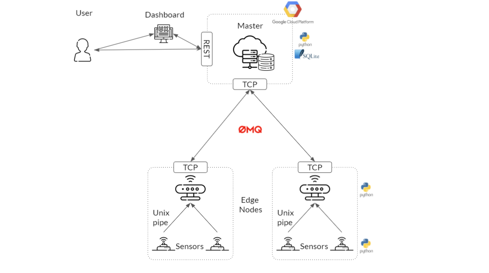

# fogmsg - Fog Computing Prototype

by Moritz Ludolph, Maximilian Bähnisch and Maher Shukur

- [fogmsg - Fog Computing Prototype](#fogmsg---fog-computing-prototype)
  - [Summary](#summary)
  - [Architecture Overview](#architecture-overview)
  - [Installation](#installation)
    - [Requirements](#requirements)
    - [Quickstart](#quickstart)
  - [Components](#components)
    - [Edge Node](#edge-node)
      - [Sensors](#sensors)
    - [Master](#master)
    - [Messaging](#messaging)
      - [Message Format](#message-format)
    - [REST interface and GUI](#rest-interface-and-gui)
  - [Demo Video](#demo-video)
  - [License](#license)

## Summary

This project serves as a prototype implementation of a Fog Computing application with edge and cloud components that communicate with each other with a lightweight and reliable messaging system.
For this, simulated GPS and device metrics are broadcasted to all connected egde nodes, which could be useful e.g. in a connected-cars scenario.
The project is implemented using Python and makes heavy use of the ZeroMQ library to provide **atleast-once** message delivery garantuee.

## Architecture Overview

|  |
| :-----------------------------------: |
|        _Architecture Overview_        |

## Installation

### Requirements

- Linux based system (Tested on Ubuntu 20.04)
- Python 3 (Tested on version 3.8.2)
- Install wheel, i.e. `pip install wheel`
- Python Packages from `requirements.txt` (i.e. run `pip install -r requirements.txt`)
- If installation of requirements still fails, run `sudo apt-get install build-essential python3-dev --yes` and retry to install the python requirements

### Quickstart

A master and a node can be easily deployed using the quick start scripts (or using docker):

**Scripts**:

```bash
$ scripts/start_master.sh &
$ scripts/start_node.sh
```

**Docker**:

```bash
$ docker-compose -f docker-compose.master.yml up -d
$ docker-compose -f docker-compose.node.yml up -d
```

Please note that the environment variables might have to be changed to fit a specific setup (i.e. `MASTER_HOSTNAME` and `NODE_ADVERTISED_LISTENER`).

**Master Arguments/Environment variables**:

```bash
$ python fogmsg/executables/master.py --help
usage: master.py [-h] [-i IP] [-p PORT] [-uip UI_PORT] [--sender-queue-length SENDER_QUEUE_LENGTH] [--sender-timeout SENDER_TIMEOUT]
                 [--persistence-dir PERSISTENCE_DIR] [--log-level {debug,info,warn,critical}] [--log-file LOG_FILE]

fogmsg Master

optional arguments:
  -h, --help            show this help message and exit
  -i IP, --ip IP        address that the node will bind to (default: 0.0.0.0, env: MASTER_IP)
  -p PORT, --port PORT  port that the node will bind to (default: 4000, env: MASTER_PORT)
  -uip UI_PORT, --ui-port UI_PORT
                        port that the node will bind to (default: 4002, env: MASTER_UI_PORT)
  --sender-queue-length SENDER_QUEUE_LENGTH
                        length of the sender queues (default: 1000, env: MASTER_SENDER_QUEUE_LENGTH)
  --sender-timeout SENDER_TIMEOUT
                        timeout of the sender in ms (default: 1000, env: MASTER_SENDER_TIMEOUT)
  --persistence-dir PERSISTENCE_DIR
                        directory for queue files (default: ./, env: MASTER_PERSISTENCE_DIR)
  --log-level {debug,info,warn,critical}
                        the log-level (default: info)
  --log-file LOG_FILE   the path to the log file, default is to write to console
```

**Node Arguments/Environment Variables**:

```bash
usage: node.py [-h] [--master-hostname MASTER_HOSTNAME] [-i IP] [-p PORT] [--advertised-listener ADVERTISED_HOSTNAME]
               [--sensor-pipes PIPE_FILES] [--sensor-types SENSOR_TYPES] [--sender-queue-length SENDER_QUEUE_LENGTH]
               [--sender-timeout SENDER_TIMEOUT] [--persistence-dir PERSISTENCE_DIR] [--log-level {debug,info,warn,critical}]
               [--log-file LOG_FILE]

fogmsg Node

optional arguments:
  -h, --help            show this help message and exit
  --master-hostname MASTER_HOSTNAME
                        hostname of the master (default: tcp://localhost:4000, env: MASTER_HOSTNAME)
  -i IP, --ip IP        address that the node will bind to (default: 0.0.0.0, env: NODE_IP)
  -p PORT, --port PORT  port that the node will bind to (default: 4001, env: NODE_PORT)
  --advertised-listener ADVERTISED_HOSTNAME
                        the advertisement listener of this node (default: tcp://localhost:4001, env: NODE_ADVERTISED_LISTENER)
  --sensor-pipes PIPE_FILES
                        the pipe file to use for ipc, to use multiple pipes, seperate them by ';' (default: /tmp/metrics;/tmp/gps)
  --sensor-types SENSOR_TYPES
                        the type of the sensors specified by the pipes, seperate them by ';' (default: metrics;gps)
  --sender-queue-length SENDER_QUEUE_LENGTH
                        length of the sender queues (default: 1000, env: NODE_SENDER_QUEUE_LENGTH)
  --sender-timeout SENDER_TIMEOUT
                        timeout of the sender in ms (default: 1000, env: NODE_SENDER_TIMEOUT)
  --persistence-dir PERSISTENCE_DIR
                        directory for queue files (default: ./, env: NODE_PERSISTENCE_DIR)
  --log-level {debug,info,warn,critical}
                        the log-level (default: info)
  --log-file LOG_FILE   the path to the log file, default is to write to console
```

## Components

### Edge Node

On startup, the **_edge node_** creates a _receiver_ thread and a ZeroMQ REP/REQ socket, which handles incoming (i.e. broadcasted) messages for processing.
The node then registers itself at the master with its adverstised hostname and pushes messages generated by its connected sensors via another socket in the main _sender_ thread.

All messages pushed to the master have to be acknowledged, otherwise they are not considered as delivered and thus not removed from the message queue to allow for re-transmission.

#### Sensors

Currently two types of (mock) sensors are implemented:

- a **_metrics_** sensor that collects OS metrics in regular intervals (i.e. CPU or memory usage)
- a **_gps_** sensor, that emits historical gps data which was collected from a real person and emitted in regular intervals

The sensors are pushing their data into a _unix FIFO pipe_.
This allows for further extension of the implemented sensors in later works.

When using the quickstart scripts or docker containers, both sensors are deployed on startup.

### Master

The **_master node_** receives all incoming messages and creates _sender_ threads for each new connection to an edge node.
Upon receiving a sensor event, the message can then be broadcast to all previously registered nodes.
For each of the senders, a seperate message queue is used, thus garantueeing reliable messaging for multiple clients.
As before, the master also only considers messages as delivered when acknowledged by a client.

The master additionally offers and [**REST** interface and **GUI**](#rest-interface-and-gui) to monitor metrics published by the nodes.
For this, all received messages are persisted to a _sqlite_ database, which could easily be replaced by a more specialized database solution (e.g. a TimescaleDB).

### Messaging

The implemented message protocol gives an **_atleast once_** delivery garantuee to messages.
This is achived by using ZeroMQ REQ/REP sockets and manual acknowledgment of received messages.
Additionally, messages are queued on the sender side until acknowledged.
The message queues are persisted on the filesystem in order to prevent loss of data in the case of system crashes.

An error free message delivery can be seen in the sequence diagram below:

|                                                                |
| :-------------------------------------------------------------------------------------------------------: |
| _Messaging_: All messages have to be acknowledged by the receiver in order to be considered as processed. |

If any timeout happens during the message delivery, the message is not considered as acknowledged and not dequeued.
Thus, once a receiver comes back online, all non-acknowledged messages can be resend.

#### Message Format

Since the size of edge-cloud messages is a critical, a lightweight schema-based serialization scheme is used instead of relying on standard JSON serialization.
For this, only values of fields are transmitted by using the provided schema information of the underlying sensors (see [`fogmsg/utils/messaging.py`](fogmsg/utils/messaging.py))

### REST interface and GUI

The master also contains a simple REST interface based on the Pyhton library `flask`, supporting `GET` requests to list registered nodse and query the last data of a sensor:

- `GET /api/sensors` - list all registered nodes

```json
[
  {
    "hashId": "81aaf9efe37b664c175a89a7800a5113",
    "hostname": "tcp://localhost:4001"
  }
]
```

- `GET /api/messages/<sensor_id>/<type>` - get all messages in the last 60 seconds (supported types: metrics, gps)

```json
[
  {
    "time": 1624802344,
    "lat": 52.41214,
    "lng": 51.412415
  },
  ...
]
```

## Demo Video

A short video demonstrating the reliable messaging can be found at .

## License

The software is licensed under MIT and is and is available publicly on Github ([https://github.com/mludolph/fogmsg](https://github.com/mludolph/fogmsg)).
